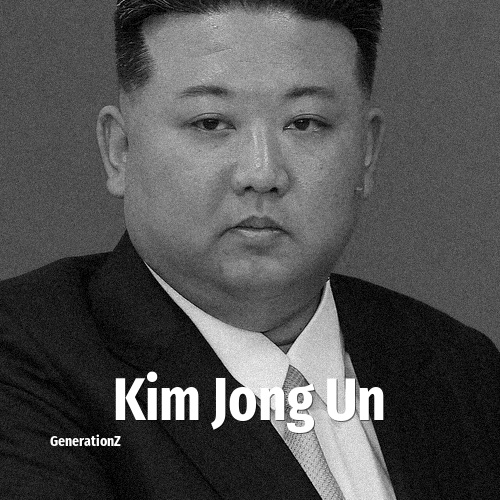

# Kim Jong Un

> **Kim Jong Un** was born in **1984**, making them a member of the Generation Y. Field: Politics.

Kim Jong Un (born 8 January c. 1982–1984) is a North Korean politician and dictator who has been serving as the supreme leader of North Korea since 2011, following the death of his father, Kim Jong Il. He is the third ruler from the Kim family to lead the country, which was founded by his grandfather Kim Il Sung. Kim holds the positions of general secretary of the Workers' Party of Korea and president of the State Affairs Commission, as well as the highest offices in the Korean People's Army.

## Facts

| | |
|---|---|
| Born | 1984 |
| Field | Politics |
| Country | North Korea |
| Generation | [Generation Y](../generations/millennials/index.md) |
| Born in | [Year 1984](../born-in/1984.md) |
| Wikipedia | [Kim Jong Un on Wikipedia](https://en.wikipedia.org/wiki/Kim_Jong_Un) |
| IMDb | [Kim Jong Un on IMDb](https://www.imdb.com/name/nm4863120/) |

----

_Last updated: 2026-09-24_
