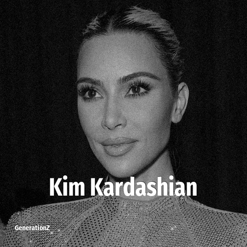

# Kim Kardashian

> **Kim Kardashian** was born in **1980**, making them a member of the Generation X. Field: Personality.

Kimberly Noel Kardashian (born October 21, 1980) is an American media personality, socialite, and businesswoman. She first gained media attention in 2007 following the unauthorized release of a sex tape with American singer Ray J. Afterwards, she and her family began to appear on the E! reality television series Keeping Up with the Kardashians. The show aired until 2021, and its success led to the formation of several spin-offs before its revival in the form of Hulu's The Kardashians (2022–present) as part of her and her family's multi-year deal with the streaming service.

## Facts

| | |
|---|---|
| Born | 1980 |
| Field | Personality |
| Country | USA |
| Generation | [Generation X](../generations/generation-x/index.md) |
| Born in | [Year 1980](../born-in/1980.md) |
| Wikipedia | [Kim Kardashian on Wikipedia](https://en.wikipedia.org/wiki/Kim_Kardashian) |
| IMDb | [Kim Kardashian on IMDb](https://www.imdb.com/name/nm2578007/) |

----

_Last updated: 2026-09-24_
