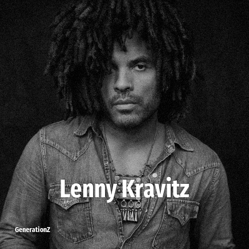

# Lenny Kravitz

> **Lenny Kravitz** was born in **1964**, making them a member of the Baby Boomers. Field: Musician.

Leonard Albert Kravitz (born May 26, 1964) is an American singer, musician, songwriter, record producer, and actor. His debut album Let Love Rule (1989) was characterized by a blend of rock, funk, reggae, hard rock, soul, and R&B, along with his subsequent releases.

## Facts

| | |
|---|---|
| Born | 1964 |
| Field | Musician |
| Country | USA |
| Generation | [Baby Boomers](../generations/baby-boomers/index.md) |
| Born in | [Year 1964](../born-in/1964.md) |
| Wikipedia | [Lenny Kravitz on Wikipedia](https://en.wikipedia.org/wiki/Lenny_Kravitz) |
| IMDb | [Lenny Kravitz on IMDb](https://www.imdb.com/name/nm0005107/) |

----

_Last updated: 2026-09-24_
