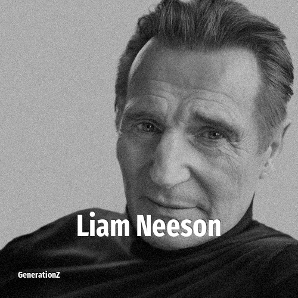

# Liam Neeson

> **Liam Neeson** was born in **1952**, making them a member of the Baby Boomers. Field: Actor.

William John Neeson (born 7 June 1952) is an actor from Northern Ireland. He has received several accolades, including nominations for an Academy Award, a BAFTA Award, three Golden Globe Awards, two Tony Awards and one Volpi Cup. With a film career spanning more than 40 years, Neeson is regarded as one of Ireland's greatest film actors. Films in which he has appeared have grossed over US$11.7 billion worldwide. Neeson was appointed Officer of the Order of the British Empire in 2000.

## Facts

| | |
|---|---|
| Born | 1952 |
| Field | Actor |
| Country | Ireland |
| Generation | [Baby Boomers](../generations/baby-boomers/index.md) |
| Born in | [Year 1952](../born-in/1952.md) |
| Wikipedia | [Liam Neeson on Wikipedia](https://en.wikipedia.org/wiki/Liam_Neeson) |
| IMDb | [Liam Neeson on IMDb](https://www.imdb.com/name/nm0000553/) |

----

_Last updated: 2026-09-24_
