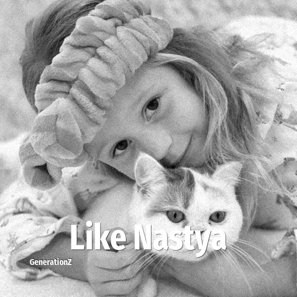

# Like Nastya

> **Like Nastya** was born in **2014**, making them a member of the Generation Alpha. Field: Personality.

Anastasia Yuryevna Radzinskaya (Russian: Анастасия Юрьевна Радзинская; born January 27, 2014), known online as Like Nastya, is a Russian-American YouTuber. She has a subsidiary channel called Learn Like Nastya.

## Facts

| | |
|---|---|
| Born | 2014 |
| Field | Personality |
| Country | Russia |
| Generation | [Generation Alpha](../generations/generation-alpha/index.md) |
| Born in | [Year 2014](../born-in/2014.md) |
| Wikipedia | [Like Nastya on Wikipedia](https://en.wikipedia.org/wiki/Like_Nastya) |
| IMDb | [Like Nastya on IMDb](https://www.imdb.com/name/nm13366682/) |

----

_Last updated: 2026-09-23_
