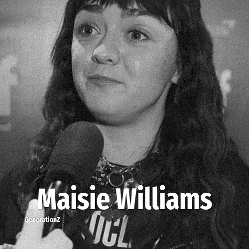

# Maisie Williams

> **Maisie Williams** was born in **1997**, making them a member of the Generation Z. Field: Actor.

Margaret Constance Williams (born 15 April 1997) is an English actress. Williams made her acting debut in 2011 as Arya Stark, a lead character in the HBO epic medieval fantasy television series Game of Thrones (2011–2019). She gained recognition and critical praise for her work on the show and received two Emmy Award nominations. Williams' other television appearances include Ashildr in the BBC science fiction series Doctor Who (2015), starring in the British docudrama television film Cyberbully (2015), and in the British science-fiction teen thriller film iBoy (2017). She played the central character in the comedy action drama miniseries Two Weeks to Live (2020), and portrayed punk rock icon Jordan in Pistol (2022), a biopic about the Sex Pistols. Williams also voiced Cammie MacCloud in the American animated web series Gen:Lock (2019–2021).

## Facts

| | |
|---|---|
| Born | 1997 |
| Field | Actor |
| Country | UK |
| Generation | [Generation Z](../generations/generation-z/index.md) |
| Born in | [Year 1997](../born-in/1997.md) |
| Wikipedia | [Maisie Williams on Wikipedia](https://en.wikipedia.org/wiki/Maisie_Williams) |
| IMDb | [Maisie Williams on IMDb](https://www.imdb.com/name/nm3586035/) |

----

_Last updated: 2026-09-24_
