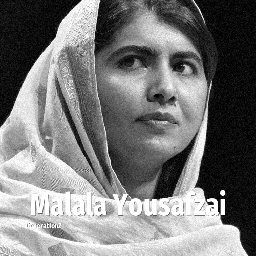

# Malala Yousafzai

> **Malala Yousafzai** was born in **1997**, making them a member of the Generation Z. Field: Politics.

Malala Yousafzai (born 12 July 1997) is a Pakistani female education activist, and producer of film and television. She is the youngest Nobel Prize laureate in history, receiving the Peace Prize in 2014 at age 17, and is the second Pakistani and the only Pashtun to receive a Nobel Prize. Yousafzai is a human rights advocate for the education of women and children in her native district, Swat, where the Pakistani Taliban had at times banned girls from attending school. Her advocacy has grown into an international movement, and according to former prime minister Shahid Khaqan Abbasi, she has become Pakistan's "most prominent citizen".

## Facts

| | |
|---|---|
| Born | 1997 |
| Field | Politics |
| Country | Pakistan |
| Generation | [Generation Z](../generations/generation-z/index.md) |
| Born in | [Year 1997](../born-in/1997.md) |
| Wikipedia | [Malala Yousafzai on Wikipedia](https://en.wikipedia.org/wiki/Malala_Yousafzai) |
| IMDb | [Malala Yousafzai on IMDb](https://www.imdb.com/name/nm5324796/) |

----

_Last updated: 2026-09-23_
