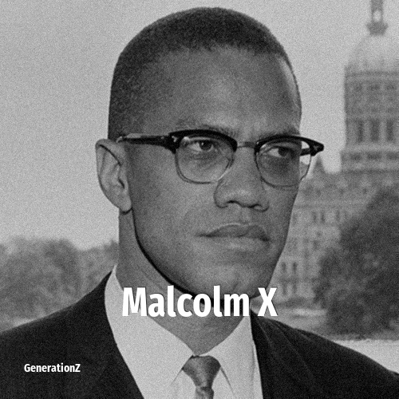

# Malcolm X

> **Malcolm X** was born in **1925**, making them a member of the Silent Generation. Field: Politics.

Malcolm X (born Malcolm Little, later el-Hajj Malik el-Shabazz; May 19, 1925 – February 21, 1965) was an African American revolutionary, civil rights activist, and Muslim minister who was a prominent figure during the civil rights movement until his assassination in 1965. He discovered the new religious movement the Nation of Islam while in prison and served as a spokesperson from 1952 until he transitioned to Sunni Islam in 1964. He is often regarded as one of the most significant Muslim figures in the history of the United States. A controversial figure accused of preaching violence, Malcolm X is also a celebrated figure within the African American community for his pursuit of racial justice and equality.

## Facts

| | |
|---|---|
| Born | 1925 |
| Field | Politics |
| Country | USA |
| Generation | [Silent Generation](../generations/silent-generation/index.md) |
| Born in | [Year 1925](../born-in/1925.md) |
| Wikipedia | [Malcolm X on Wikipedia](https://en.wikipedia.org/wiki/Malcolm_X) |
| IMDb | [Malcolm X on IMDb](https://www.imdb.com/name/nm0944318/) |

----

_Last updated: 2026-09-23_
