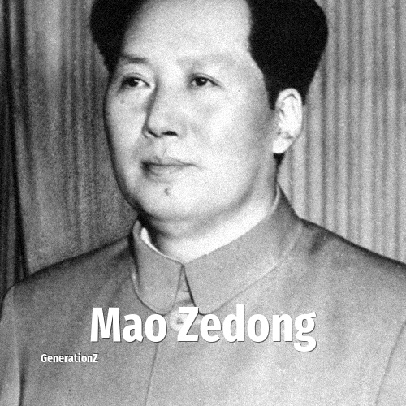

# Mao Zedong

> **Mao Zedong** was born in **1893**, making them a member of the Lost Generation. Field: Politics.

Mao Zedong (26 December 1893 – 9 September 1976) was a Chinese communist revolutionary, political theorist and the founder of the People's Republic of China. He led China from the PRC's establishment in October 1949 until his death in September 1976, primarily through his role as the Chairman of the Chinese Communist Party. Mao Zedong Thought, which he advocated as a Chinese adaptation of Marxism–Leninism, influenced organizations worldwide.

## Facts

| | |
|---|---|
| Born | 1893 |
| Field | Politics |
| Country | China |
| Generation | [Lost Generation](../generations/lost-generation/index.md) |
| Born in | [Year 1893](../born-in/1893.md) |
| Wikipedia | [Mao Zedong on Wikipedia](https://en.wikipedia.org/wiki/Mao_Zedong) |
| IMDb | [Mao Zedong on IMDb](https://www.imdb.com/name/nm0544552/) |

----

_Last updated: 2026-09-23_
