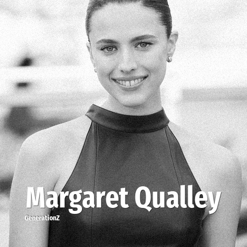

# Margaret Qualley

> **Margaret Qualley** was born in **1994**, making them a member of the Generation Y. Field: Actor.

Sarah Margaret Qualley (born October 23, 1994) is an American actress. A daughter of actress Andie MacDowell, she trained as a ballet dancer in her youth. She made her acting debut in the 2013 drama film Palo Alto and gained recognition for her supporting role in the HBO drama series The Leftovers (2014–2017).

## Facts

| | |
|---|---|
| Born | 1994 |
| Field | Actor |
| Country | USA |
| Generation | [Generation Y](../generations/millennials/index.md) |
| Born in | [Year 1994](../born-in/1994.md) |
| Wikipedia | [Margaret Qualley on Wikipedia](https://en.wikipedia.org/wiki/Margaret_Qualley) |
| IMDb | [Margaret Qualley on IMDb](https://www.imdb.com/name/nm4960279/) |

----

_Last updated: 2026-09-24_
