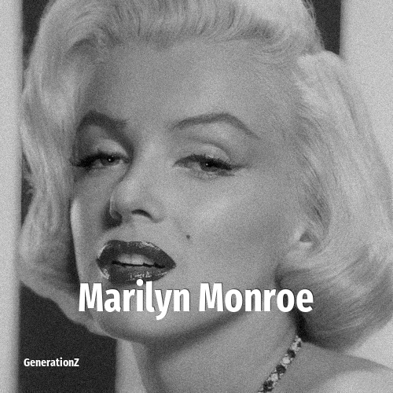

# Marilyn Monroe

> **Marilyn Monroe** was born in **1926**, making them a member of the Silent Generation. Field: Actor.

Marilyn Monroe (born Norma Jeane Mortenson; June 1, 1926 – August 4, 1962) was an American actress and model. Known for playing comic "Blonde bombshell" characters, she became one of the most popular sex symbols of the 1950s and early 1960s, as well as an emblem of the era's sexual revolution. She was a top-billed actress for a decade, and her films grossed $200 million (equivalent to $2 billion in 2025) by her death in 1962.

## Facts

| | |
|---|---|
| Born | 1926 |
| Field | Actor |
| Country | USA |
| Generation | [Silent Generation](../generations/silent-generation/index.md) |
| Born in | [Year 1926](../born-in/1926.md) |
| Wikipedia | [Marilyn Monroe on Wikipedia](https://en.wikipedia.org/wiki/Marilyn_Monroe) |
| IMDb | [Marilyn Monroe on IMDb](https://www.imdb.com/name/nm0000054/) |

----

_Last updated: 2026-09-24_
