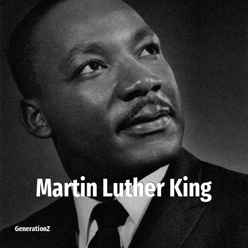

# Martin Luther King

> **Martin Luther King** was born in **1929**, making them a member of the Silent Generation. Field: Politics.

Martin Luther King Jr. (born Michael King Jr.; January 15, 1929 – April 4, 1968) was an American civil rights activist and Baptist minister who was a prominent leader of the civil rights movement from 1955 until his assassination in 1968. He advanced civil rights for people of color in the United States through the use of nonviolent resistance and civil disobedience against Jim Crow laws and other forms of legalized discrimination, which most commonly affected African Americans.

## Facts

| | |
|---|---|
| Born | 1929 |
| Field | Politics |
| Country | USA |
| Generation | [Silent Generation](../generations/silent-generation/index.md) |
| Born in | [Year 1929](../born-in/1929.md) |
| Wikipedia | [Martin Luther King on Wikipedia](https://en.wikipedia.org/wiki/Martin_Luther_King_Jr.) |
| IMDb | [Martin Luther King on IMDb](https://www.imdb.com/name/nm0455052/) |

----

_Last updated: 2026-09-24_
