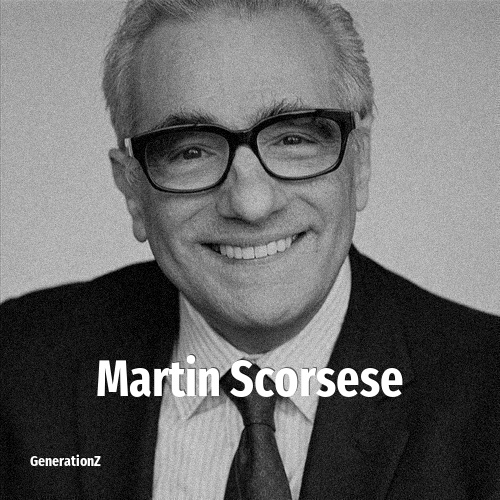

# Martin Scorcese

> **Martin Scorcese** was born in **1942**, making them a member of the Silent Generation. Field: Director.

Martin Charles Scorsese (born November 17, 1942) is an American filmmaker. One of the major figures of the New Hollywood era, he is widely considered one of the greatest and most influential directors in the history of cinema. He has received numerous accolades including an Academy Award, four BAFTA Awards, three Emmy Awards, a Grammy Award, and three Golden Globe Awards. Scorsese has also been honored with the AFI Life Achievement Award in 1997, the Film Society of Lincoln Center tribute in 1998, the Kennedy Center Honor in 2007, the Cecil B. DeMille Award in 2010, and the BAFTA Fellowship in 2012. Five of his films have been inducted into the National Film Registry by the Library of Congress as "culturally, historically or aesthetically significant".

## Facts

| | |
|---|---|
| Born | 1942 |
| Field | Director |
| Country | USA |
| Generation | [Silent Generation](../generations/silent-generation/index.md) |
| Born in | [Year 1942](../born-in/1942.md) |
| Wikipedia | [Martin Scorcese on Wikipedia](https://en.wikipedia.org/wiki/Martin_Scorsese) |
| IMDb | [Martin Scorcese on IMDb](https://www.imdb.com/name/nm0000217/) |

----

_Last updated: 2026-09-23_
