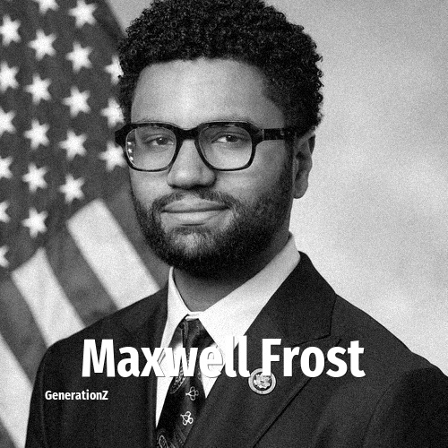

# Maxwell Frost

> **Maxwell Frost** was born in **1997**, making them a member of the Generation Z. Field: Politics.

Maxwell Alejandro Frost (born January 17, 1997) is an American politician and activist serving as the U.S. representative for Florida's 10th congressional district since 2023. Previously, he was the national organizing director for March for Our Lives. He is a member of the Democratic Party.

## Facts

| | |
|---|---|
| Born | 1997 |
| Field | Politics |
| Country | USA |
| Generation | [Generation Z](../generations/generation-z/index.md) |
| Born in | [Year 1997](../born-in/1997.md) |
| Wikipedia | [Maxwell Frost on Wikipedia](https://en.wikipedia.org/wiki/Maxwell_Frost) |
| IMDb | [Maxwell Frost on IMDb](https://www.imdb.com/name/nm12921894/) |

----

_Last updated: 2026-09-23_
