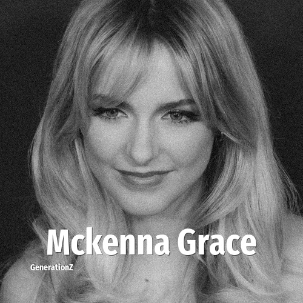

# Mckenna Grace

> **Mckenna Grace** was born in **2006**, making them a member of the Generation Z. Field: Actor.

Mckenna Grace Burge (born June 25, 2006) is an American actress and singer. Her earliest roles included Jasmine Bernstein in the Disney XD sitcom Crash & Bernstein (2012–2014) and Faith Newman in the soap opera The Young and the Restless (2013–2015). After several small roles, she starred as a child prodigy in Gifted (2017), a breakthrough for which she received a nomination for the Critics' Choice Movie Award for Best Young Performer.

## Facts

| | |
|---|---|
| Born | 2006 |
| Field | Actor |
| Country | USA |
| Generation | [Generation Z](../generations/generation-z/index.md) |
| Born in | [Year 2006](../born-in/2006.md) |
| Wikipedia | [Mckenna Grace on Wikipedia](https://en.wikipedia.org/wiki/Mckenna_Grace) |
| IMDb | [Mckenna Grace on IMDb](https://www.imdb.com/name/nm5085683/) |

----

_Last updated: 2026-09-23_
