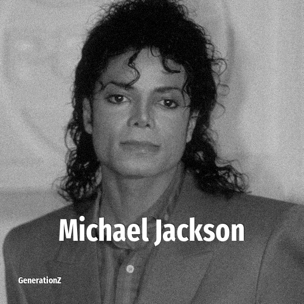

# Michael Jackson

> **Michael Jackson** was born in **1958**, making them a member of the Baby Boomers. Field: Musician.

Michael Joseph Jackson (August 29, 1958 – June 25, 2009) was an American singer, songwriter, dancer, and philanthropist. Dubbed the "King of Pop", Jackson is widely regarded as one of the most culturally significant figures of the 20th century. His musical achievements broke American racial barriers and made him a dominant figure worldwide. Through his songs, music videos, concerts, and fashion, he transformed visual performance in popular music, popularizing street dance moves such as the moonwalk, the robot, and the anti-gravity lean. Jackson is often deemed the greatest entertainer of all time.

## Facts

| | |
|---|---|
| Born | 1958 |
| Field | Musician |
| Country | USA |
| Generation | [Baby Boomers](../generations/baby-boomers/index.md) |
| Born in | [Year 1958](../born-in/1958.md) |
| Wikipedia | [Michael Jackson on Wikipedia](https://en.wikipedia.org/wiki/Michael_Jackson) |
| IMDb | [Michael Jackson on IMDb](https://www.imdb.com/name/nm0001391/) |

----

_Last updated: 2026-09-23_
