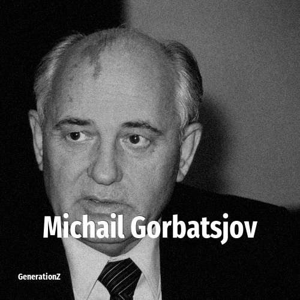

# Michail Gorbatsjov

> **Michail Gorbatsjov** was born in **1931**, making them a member of the Silent Generation. Field: Politics.

Mikhail Sergeyevich Gorbachev (2 March 1931 – 30 August 2022) was a Soviet and Russian politician who was the last leader of the Soviet Union from 1985 until the country's dissolution in 1991. He served as General Secretary of the Communist Party from 1985, and additionally as head of state from 1988. Ideologically, he initially adhered to Marxism–Leninism, but moved towards social democracy by the early 1990s.

## Facts

| | |
|---|---|
| Born | 1931 |
| Field | Politics |
| Country | Russia |
| Generation | [Silent Generation](../generations/silent-generation/index.md) |
| Born in | [Year 1931](../born-in/1931.md) |
| Wikipedia | [Michail Gorbatsjov on Wikipedia](https://en.wikipedia.org/wiki/Mikhail_Gorbachev) |
| IMDb | [Michail Gorbatsjov on IMDb](https://www.imdb.com/name/nm0329784/) |

----

_Last updated: 2026-09-24_
