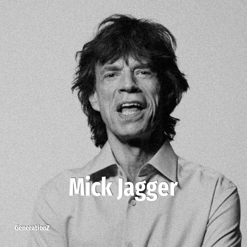

# Mick Jagger

> **Mick Jagger** was born in **1943**, making them a member of the Silent Generation. Field: Musician.

Sir Michael Philip Jagger (born 26 July 1943) is an English musician, songwriter, and film producer known as the lead singer and founder member of the Rolling Stones. Jagger has co-written most of the Stones' songs with lead guitarist Keith Richards; their songwriting partnership is one of the most successful in rock music history. His career has spanned more than six decades, and he has been widely described as one of the most popular and influential front men in the history of rock music. His distinctive voice and energetic live performances, along with Richards's guitar style, have been the Rolling Stones' trademark throughout the band's career. Early in his career, Jagger gained notoriety for his romantic involvements and illicit drug use, and has often been portrayed as a countercultural figure.

## Facts

| | |
|---|---|
| Born | 1943 |
| Field | Musician |
| Country | UK |
| Generation | [Silent Generation](../generations/silent-generation/index.md) |
| Born in | [Year 1943](../born-in/1943.md) |
| Wikipedia | [Mick Jagger on Wikipedia](https://en.wikipedia.org/wiki/Mick_Jagger) |
| IMDb | [Mick Jagger on IMDb](https://www.imdb.com/name/nm0001396/) |

----

_Last updated: 2026-09-24_
