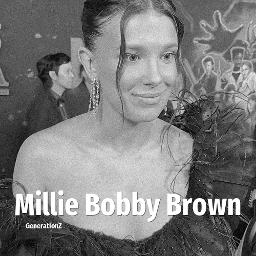

# Millie Bobby Brown

> **Millie Bobby Brown** was born in **2004**, making them a member of the Generation Z. Field: Actor.

Millie Bonnie Bongiovi (née Brown; born 19 February 2004), known professionally as Millie Bobby Brown, is a British actress and film producer. She gained international recognition for playing Eleven in the Netflix science fiction series Stranger Things (2016–2025), for which she received nominations for two Primetime Emmy Awards. In 2018, Brown was featured in the Time 100 list of the world's most influential people. She was the youngest person ever appointed as a UNICEF Goodwill Ambassador.

## Facts

| | |
|---|---|
| Born | 2004 |
| Field | Actor |
| Country | UK |
| Generation | [Generation Z](../generations/generation-z/index.md) |
| Born in | [Year 2004](../born-in/2004.md) |
| Wikipedia | [Millie Bobby Brown on Wikipedia](https://en.wikipedia.org/wiki/Millie_Bobby_Brown) |
| IMDb | [Millie Bobby Brown on IMDb](https://www.imdb.com/name/nm5611121/) |

----

_Last updated: 2026-09-24_
