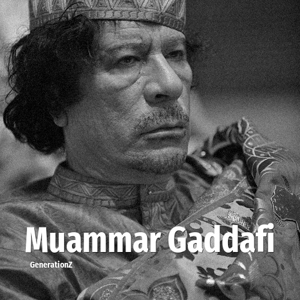

# Muammar Gaddafi

> **Muammar Gaddafi** was born in **1942**, making them a member of the Silent Generation. Field: Politics.

Muammar Muhammad Abu Minyar al-Gaddafi (c. 1942 – 20 October 2011) was a Libyan military officer, revolutionary, politician, and political theorist who ruled Libya from 1969 until his overthrow by Libyan rebel forces in 2011 during the First Libyan Civil War. He came to power through a bloodless military coup, first becoming Revolutionary Chairman of the Libyan Arab Republic from 1969 to 1977, Secretary General of the General People's Congress from 1977 to 1979, and then the Brotherly Leader of the Great Socialist People's Libyan Arab Jamahiriya from 1979 to 2011. Initially ideologically committed to Arab nationalism and Arab socialism, Gaddafi later ruled according to his own Third International Theory.

## Facts

| | |
|---|---|
| Born | 1942 |
| Field | Politics |
| Country | Libya |
| Generation | [Silent Generation](../generations/silent-generation/index.md) |
| Born in | [Year 1942](../born-in/1942.md) |
| Wikipedia | [Muammar Gaddafi on Wikipedia](https://en.wikipedia.org/wiki/Muammar_Gaddafi) |
| IMDb | [Muammar Gaddafi on IMDb](https://www.imdb.com/name/nm0300490/) |

----

_Last updated: 2026-09-23_
