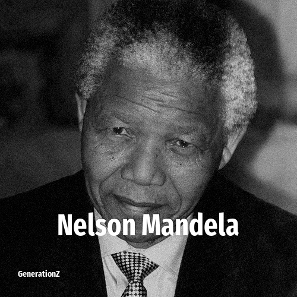

# Nelson Mandela

> **Nelson Mandela** was born in **1918**, making them a member of the Greatest Generation. Field: Politics.

Nelson Rolihlahla Mandela (18 July 1918 – 5 December 2013) was a South African anti-apartheid revolutionary, politician, and philanthropist, who served as President of South Africa from 1994 to 1999. He was the country's first black head of state and the first elected in a fully representative democratic election. His government focused on dismantling the legacy of apartheid by tackling institutionalised racism and fostering racial reconciliation. Ideologically an African nationalist and socialist, he served as President of the African National Congress party from 1991 to 1997.

## Facts

| | |
|---|---|
| Born | 1918 |
| Field | Politics |
| Country | South-africa |
| Generation | [Greatest Generation](../generations/greatest-generation/index.md) |
| Born in | [Year 1918](../born-in/1918.md) |
| Wikipedia | [Nelson Mandela on Wikipedia](https://en.wikipedia.org/wiki/Nelson_Mandela) |
| IMDb | [Nelson Mandela on IMDb](https://www.imdb.com/name/nm0541691/) |

----

_Last updated: 2026-09-23_
