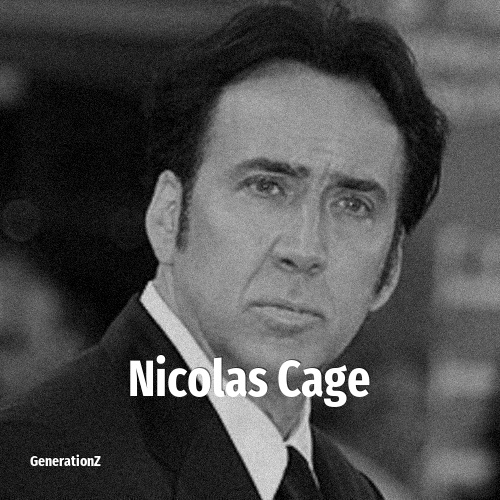

# Nicolas Cage

> **Nicolas Cage** was born in **1964**, making them a member of the Baby Boomers. Field: Actor.

Nicolas Cage (born Nicolas Kim Coppola; January 7, 1964) is an American actor and film producer. He is the recipient of various accolades, including an Academy Award, a Screen Actors Guild Award, and a Golden Globe Award as well as nominations for two BAFTA Awards. Known for his versatility as an actor, Cage's work across diverse film genres has gained him a significant cult following.

## Facts

| | |
|---|---|
| Born | 1964 |
| Field | Actor |
| Country | USA |
| Generation | [Baby Boomers](../generations/baby-boomers/index.md) |
| Born in | [Year 1964](../born-in/1964.md) |
| Wikipedia | [Nicolas Cage on Wikipedia](https://en.wikipedia.org/wiki/Nicolas_Cage) |
| IMDb | [Nicolas Cage on IMDb](https://www.imdb.com/name/nm0000115/) |

----

_Last updated: 2026-09-23_
