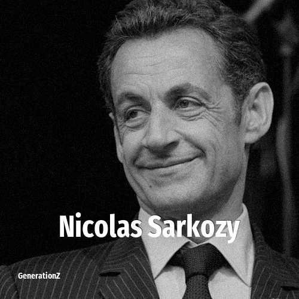

# Nicolas Sarkozy

> **Nicolas Sarkozy** was born in **1955**, making them a member of the Baby Boomers. Field: Politics.

Nicolas Paul Stéphane Sarközy de Nagy-Bocsa (born 28 January 1955) is a French former politician who served as the president of the French Republic from 2007 to 2012.

## Facts

| | |
|---|---|
| Born | 1955 |
| Field | Politics |
| Country | France |
| Generation | [Baby Boomers](../generations/baby-boomers/index.md) |
| Born in | [Year 1955](../born-in/1955.md) |
| Wikipedia | [Nicolas Sarkozy on Wikipedia](https://en.wikipedia.org/wiki/Nicolas_Sarkozy) |
| IMDb | [Nicolas Sarkozy on IMDb](https://www.imdb.com/name/nm0765324/) |

----

_Last updated: 2026-09-24_
