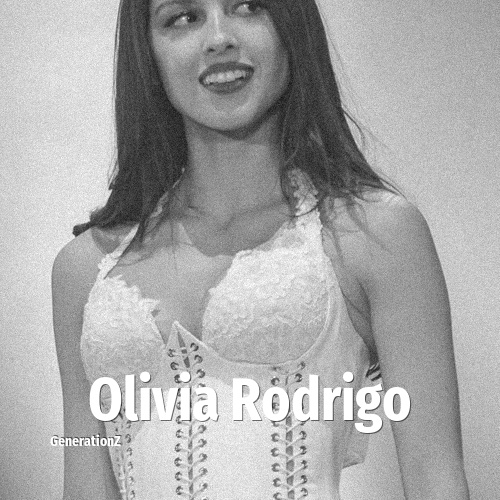

# Olivia Rodrigo

> **Olivia Rodrigo** was born in **2003**, making them a member of the Generation Z. Field: Musician.

Olivia Isabel Rodrigo (born February 20, 2003) is an American singer-songwriter and actress. Rodrigo began her career as a child actress, appearing in commercials and the direct-to-video film An American Girl: Grace Stirs Up Success (2015). She rose to prominence with her leading roles in the Disney Channel series Bizaardvark (2016–2019) and the Disney+ series High School Musical: The Musical: The Series (2019–2022).

## Facts

| | |
|---|---|
| Born | 2003 |
| Field | Musician |
| Country | USA |
| Generation | [Generation Z](../generations/generation-z/index.md) |
| Born in | [Year 2003](../born-in/2003.md) |
| Wikipedia | [Olivia Rodrigo on Wikipedia](https://en.wikipedia.org/wiki/Olivia_Rodrigo) |
| IMDb | [Olivia Rodrigo on IMDb](https://www.imdb.com/name/nm7111120/) |

----

_Last updated: 2026-09-23_
