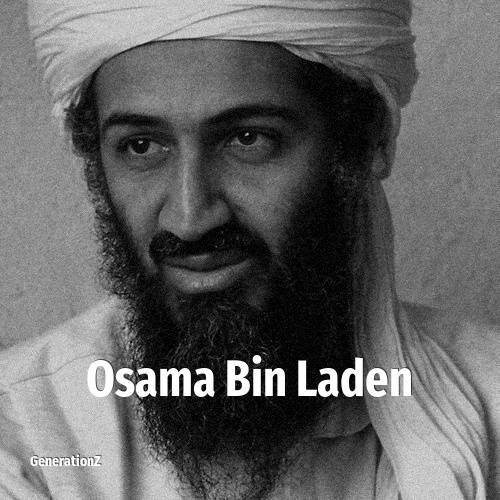

# Osama Bin laden

> **Osama Bin laden** was born in **1957**, making them a member of the Baby Boomers. Field: Politics.

Osama bin Muhammad bin Awad bin Laden (10 March 1957 – 2 May 2011) was the founder and first general emir of al-Qaeda, a Salafi jihadist militant organization, from 1988 until his killing in 2011. During that era, he was one of the most significant supporters of Islamic terrorism and jihadist militant movements around the world, as he aimed to found a pan-Islamic caliphate and end the United States' interventionism in the Middle East, including its support for Israel. Most notably, bin Laden helped orchestrate the September 11 attacks against the U.S. in 2001, which caused the U.S.-led global war on terror. He led al-Qaeda and its allies in numerous wars, including the Second Afghan Civil War (1992–1996), Bosnian War (1992–1995), Algerian Civil War (1992–2002), and Third Afghan Civil War (1996–2001).

## Facts

| | |
|---|---|
| Born | 1957 |
| Field | Politics |
| Country | Saudi Arabia |
| Generation | [Baby Boomers](../generations/baby-boomers/index.md) |
| Born in | [Year 1957](../born-in/1957.md) |
| Wikipedia | [Osama Bin laden on Wikipedia](https://en.wikipedia.org/wiki/Osama_bin_Laden) |
| IMDb | [Osama Bin laden on IMDb](https://www.imdb.com/name/nm1136915/) |

----

_Last updated: 2026-09-23_
