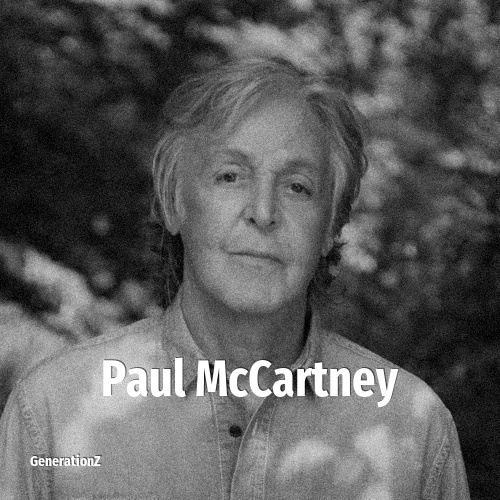

# Paul McCartney

> **Paul McCartney** was born in **1942**, making them a member of the Silent Generation. Field: Musician.

Sir James Paul McCartney (born 18 June 1942) is an English musician and songwriter. He gained global fame with the Beatles, for whom he was the bassist and keyboardist, and shared primary songwriting and lead vocal duties with John Lennon. McCartney is known for his melodic approach to bass-playing, versatile tenor vocal range and musical eclecticism, exploring genres ranging from pre–rock and roll pop to classical, ballads and electronica. His songwriting partnership with Lennon remains the most successful in music history.

## Facts

| | |
|---|---|
| Born | 1942 |
| Field | Musician |
| Country | UK |
| Generation | [Silent Generation](../generations/silent-generation/index.md) |
| Born in | [Year 1942](../born-in/1942.md) |
| Wikipedia | [Paul McCartney on Wikipedia](https://en.wikipedia.org/wiki/Paul_McCartney) |
| IMDb | [Paul McCartney on IMDb](https://www.imdb.com/name/nm0005200/) |

----

_Last updated: 2026-09-23_
