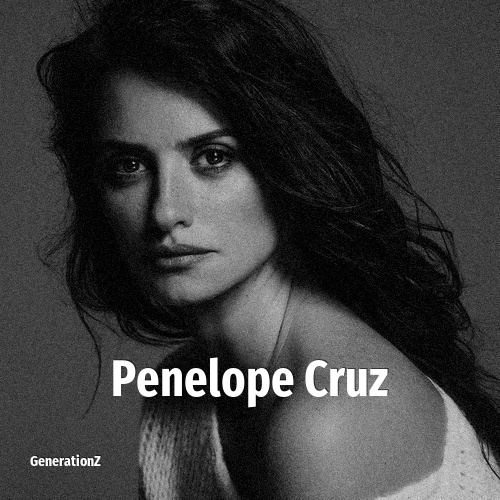

# Penelope Cruz

> **Penelope Cruz** was born in **1974**, making them a member of the Generation X. Field: Actor.

Penélope Cruz Sánchez (born 28 April 1974) is a Spanish actress. Prolific in Spanish and English-language films, her accolades include an Academy Award, BAFTA Award, a Grammy Award and three Goya Awards and a David di Donatello.

## Facts

| | |
|---|---|
| Born | 1974 |
| Field | Actor |
| Country | Spain |
| Generation | [Generation X](../generations/generation-x/index.md) |
| Born in | [Year 1974](../born-in/1974.md) |
| Wikipedia | [Penelope Cruz on Wikipedia](https://en.wikipedia.org/wiki/Pen%C3%A9lope_Cruz) |
| IMDb | [Penelope Cruz on IMDb](https://www.imdb.com/name/nm0004851/) |

----

_Last updated: 2026-09-24_
