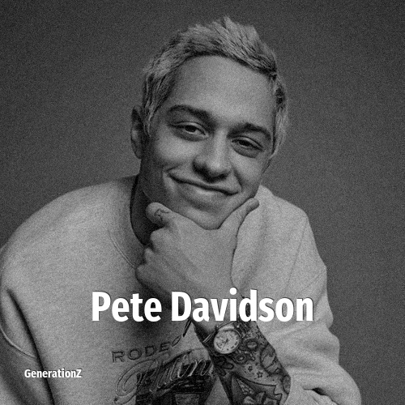

# Pete Davidson

> **Pete Davidson** was born in **1993**, making them a member of the Generation Y. Field: Comedian.

Peter Michael Davidson (born November 16, 1993) is an American comedian, actor, and writer. He began his career in the early 2010s with minor guest roles on Brooklyn Nine-Nine, Friends of the People, Guy Code, and Wild 'n Out before being hired as a cast member on the NBC late-night sketch comedy series Saturday Night Live which he starred in for eight seasons from 2014 to 2022.

## Facts

| | |
|---|---|
| Born | 1993 |
| Field | Comedian |
| Country | USA |
| Generation | [Generation Y](../generations/millennials/index.md) |
| Born in | [Year 1993](../born-in/1993.md) |
| Wikipedia | [Pete Davidson on Wikipedia](https://en.wikipedia.org/wiki/Pete_Davidson) |
| IMDb | [Pete Davidson on IMDb](https://www.imdb.com/name/nm0203457/) |

----

_Last updated: 2026-09-23_
