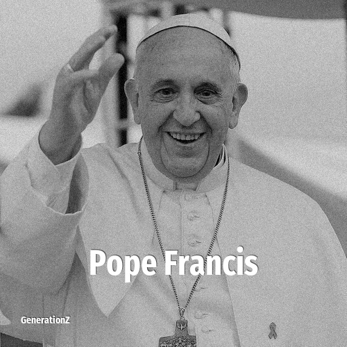

# Pope Francis

> **Pope Francis** was born in **1936**, making them a member of the Silent Generation. Field: Religion.

Pope Francis (born Jorge Mario Bergoglio; 17 December 1936 – 21 April 2025) was the head of the Catholic Church and sovereign of Vatican City from 13 March 2013 until his death in 2025. He was the first Jesuit pope, the first Latin American, and the first pope born or raised outside Europe since the 8th-century Syrian pope Gregory III.

## Facts

| | |
|---|---|
| Born | 1936 |
| Field | Religion |
| Country | Argentina |
| Generation | [Silent Generation](../generations/silent-generation/index.md) |
| Born in | [Year 1936](../born-in/1936.md) |
| Wikipedia | [Pope Francis on Wikipedia](https://en.wikipedia.org/wiki/Pope_Francis) |
| IMDb | [Pope Francis on IMDb](https://www.imdb.com/name/nm5571029/) |

----

_Last updated: 2026-09-23_
