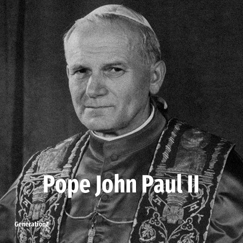

# Pope John Paul II

> **Pope John Paul II** was born in **1920**, making them a member of the Greatest Generation. Field: Religion.

Pope John Paul II (born Karol Józef Wojtyła; 18 May 1920 – 2 April 2005) was the head of the Catholic Church and sovereign of Vatican City from 16 October 1978 until his death in 2005. He was the first non-Italian pope since Adrian VI in the 16th century, as well as the third longest-serving pope in history, after St. Peter and Pius IX. In addition to this, he was an important philosopher and theologian of the 20th century.

## Facts

| | |
|---|---|
| Born | 1920 |
| Field | Religion |
| Country | Poland |
| Generation | [Greatest Generation](../generations/greatest-generation/index.md) |
| Born in | [Year 1920](../born-in/1920.md) |
| Wikipedia | [Pope John Paul II on Wikipedia](https://en.wikipedia.org/wiki/Pope_John_Paul_II) |
| IMDb | [Pope John Paul II on IMDb](https://www.imdb.com/name/nm0937552/) |

----

_Last updated: 2026-09-24_
