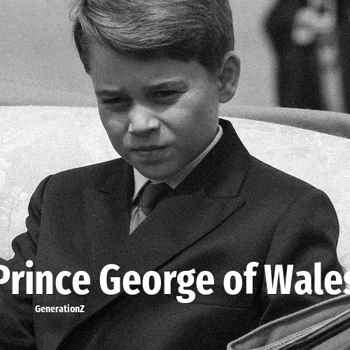

# Prince George of Wales

> **Prince George of Wales** was born in **2013**, making them a member of the Generation Alpha. Field: Royalty.

Prince George of Wales (George Alexander Louis; born 22 July 2013) is a member of the British royal family. He is the eldest child of William, Prince of Wales, and Catherine, Princess of Wales, and the eldest grandchild of King Charles III and Diana, Princess of Wales. He is second in the line of succession to the British throne, behind his father.

## Facts

| | |
|---|---|
| Born | 2013 |
| Field | Royalty |
| Country | UK |
| Generation | [Generation Alpha](../generations/generation-alpha/index.md) |
| Born in | [Year 2013](../born-in/2013.md) |
| Wikipedia | [Prince George of Wales on Wikipedia](https://en.wikipedia.org/wiki/Prince_George_of_Wales) |
| IMDb | [Prince George of Wales on IMDb](https://www.imdb.com/name/nm6416122/) |

----

_Last updated: 2026-09-24_
