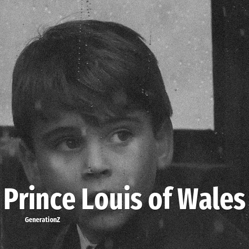

# Prince Louis of Wales

> **Prince Louis of Wales** was born in **2018**, making them a member of the Generation Alpha. Field: Royalty.

Prince Louis of Wales (Louis Arthur Charles; born 23 April 2018) is a member of the British royal family. He is the third and youngest child of William, Prince of Wales, and Catherine, Princess of Wales, and a grandson of King Charles III and Diana, Princess of Wales. He is fourth in the line of succession to the British throne. Louis was born at St Mary's Hospital, London, during the reign of his paternal great-grandmother, Queen Elizabeth II, and was fifth in line before her death.

## Facts

| | |
|---|---|
| Born | 2018 |
| Field | Royalty |
| Country | UK |
| Generation | [Generation Alpha](../generations/generation-alpha/index.md) |
| Born in | [Year 2018](../born-in/2018.md) |
| Wikipedia | [Prince Louis of Wales on Wikipedia](https://en.wikipedia.org/wiki/Prince_Louis_of_Wales) |
| IMDb | [Prince Louis of Wales on IMDb](https://www.imdb.com/name/nm9803099/) |

----

_Last updated: 2026-09-24_
