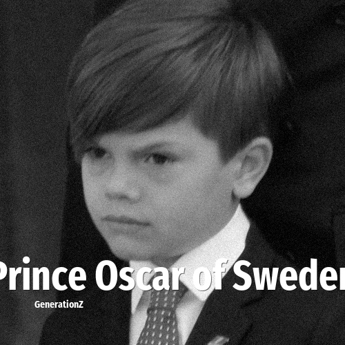

# Prince Oscar of Sweden

> **Prince Oscar of Sweden** was born in **2016**, making them a member of the Generation Alpha. Field: Royalty.

Prince Oscar of Sweden, Duke of Skåne (Oscar Carl Olof; born 2 March 2016) is the younger child and only son of Crown Princess Victoria and her husband, Prince Daniel. He is a grandson of King Carl XVI Gustaf and Queen Silvia and is third in the line of succession to the Swedish throne, after his mother and his sister, Princess Estelle.

## Facts

| | |
|---|---|
| Born | 2016 |
| Field | Royalty |
| Country | Sweden |
| Generation | [Generation Alpha](../generations/generation-alpha/index.md) |
| Born in | [Year 2016](../born-in/2016.md) |
| Wikipedia | [Prince Oscar of Sweden on Wikipedia](https://en.wikipedia.org/wiki/Prince_Oscar,_Duke_of_Sk%C3%A5ne) |

----

_Last updated: 2026-09-24_
