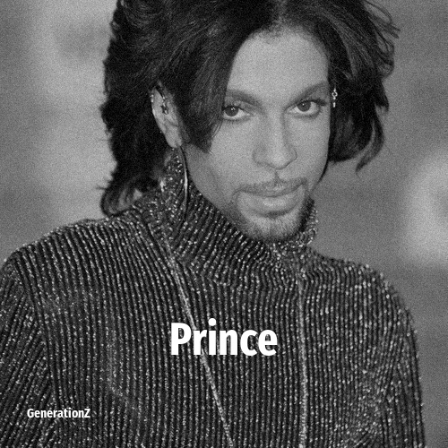

# Prince

> **Prince** was born in **1958**, making them a member of the Baby Boomers. Field: Musician.

Prince Rogers Nelson (June 7, 1958 – April 21, 2016) was an American singer, songwriter, musician, dancer, actor, and filmmaker. Often credited as one of the greatest musicians of his generation, he pioneered the Minneapolis sound and was influential in the evolution of various other genres. With estimated sales exceeding 100 million records, Prince is one of the best-selling music artists of all time.

## Facts

| | |
|---|---|
| Born | 1958 |
| Field | Musician |
| Country | USA |
| Generation | [Baby Boomers](../generations/baby-boomers/index.md) |
| Born in | [Year 1958](../born-in/1958.md) |
| Wikipedia | [Prince on Wikipedia](https://en.wikipedia.org/wiki/Prince_(musician)) |
| IMDb | [Prince on IMDb](https://www.imdb.com/name/nm0002239/) |

----

_Last updated: 2026-09-23_
