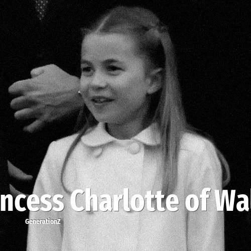

# Princess Charlotte of Wales

> **Princess Charlotte of Wales** was born in **2015**, making them a member of the Generation Alpha. Field: Royalty.

Princess Charlotte of Wales (Charlotte Elizabeth Diana; born 2 May 2015) is a member of the British royal family. She is the second child and only daughter of William, Prince of Wales, and Catherine, Princess of Wales, and a granddaughter of King Charles III and Diana, Princess of Wales. She is third in the line of succession to the British throne. Charlotte was born at St Mary's Hospital, London, during the reign of her paternal great-grandmother, Queen Elizabeth II, and was fourth in line before her great-grandmother's death.

## Facts

| | |
|---|---|
| Born | 2015 |
| Field | Royalty |
| Country | UK |
| Generation | [Generation Alpha](../generations/generation-alpha/index.md) |
| Born in | [Year 2015](../born-in/2015.md) |
| Wikipedia | [Princess Charlotte of Wales on Wikipedia](https://en.wikipedia.org/wiki/Princess_Charlotte_of_Wales_(born_2015)) |
| IMDb | [Princess Charlotte of Wales on IMDb](https://www.imdb.com/name/nm7303568/) |

----

_Last updated: 2026-09-24_
