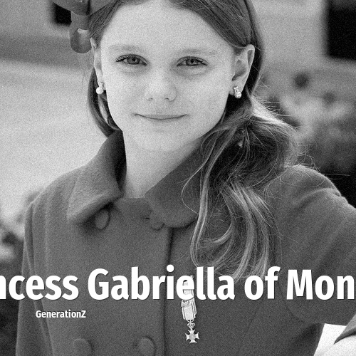

# Princess Gabriella of Monaco

> **Princess Gabriella of Monaco** was born in **2014**, making them a member of the Generation Alpha. Field: Royalty.

Princess Gabriella of Monaco, Countess of Carladès (Gabriella Thérèse Marie Grimaldi; born 10 December 2014), is the daughter of Prince Albert II and Princess Charlene. She is second in the line of succession to the Monegasque throne, behind her twin brother, Hereditary Prince Jacques.

## Facts

| | |
|---|---|
| Born | 2014 |
| Field | Royalty |
| Country | Monaco |
| Generation | [Generation Alpha](../generations/generation-alpha/index.md) |
| Born in | [Year 2014](../born-in/2014.md) |
| Wikipedia | [Princess Gabriella of Monaco on Wikipedia](https://en.wikipedia.org/wiki/Princess_Gabriella,_Countess_of_Carlad%C3%A8s) |

----

_Last updated: 2026-09-24_
