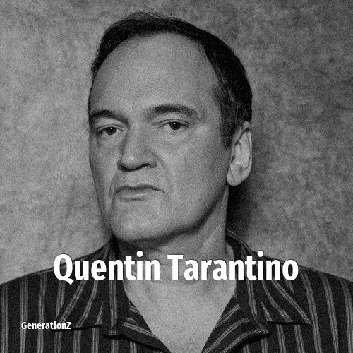

# Quentin Tarantino

> **Quentin Tarantino** was born in **1963**, making them a member of the Baby Boomers. Field: Director.

Quentin Jerome Tarantino (born March 27, 1963) is an American filmmaker, actor, and author. His films are characterized by graphic violence, extended dialogue often featuring much profanity, and references to popular culture. His work has earned a cult following alongside critical and commercial success, and he has been named by some as the most influential director of his generation. Tarantino has received numerous accolades including two Academy Awards, two BAFTA Awards, and four Golden Globe Awards, as well as nominations for a Primetime Emmy Award and five Grammy Awards. His films have collectively grossed more than $1.9 billion worldwide.

## Facts

| | |
|---|---|
| Born | 1963 |
| Field | Director |
| Country | USA |
| Generation | [Baby Boomers](../generations/baby-boomers/index.md) |
| Born in | [Year 1963](../born-in/1963.md) |
| Wikipedia | [Quentin Tarantino on Wikipedia](https://en.wikipedia.org/wiki/Quentin_Tarantino) |
| IMDb | [Quentin Tarantino on IMDb](https://www.imdb.com/name/nm0000233/) |

----

_Last updated: 2026-09-24_
