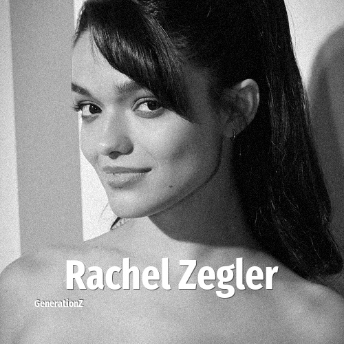

# Rachel Zegler

> **Rachel Zegler** was born in **2001**, making them a member of the Generation Z. Field: Actor.

Rachel Anne Zegler (born May 3, 2001) is an American actress and singer. Zegler gained recognition for her performance as María in Steven Spielberg's film adaptation of the musical West Side Story (2021), for which she earned the Golden Globe Award for Best Actress in a Motion Picture – Musical or Comedy.

## Facts

| | |
|---|---|
| Born | 2001 |
| Field | Actor |
| Country | USA |
| Generation | [Generation Z](../generations/generation-z/index.md) |
| Born in | [Year 2001](../born-in/2001.md) |
| Wikipedia | [Rachel Zegler on Wikipedia](https://en.wikipedia.org/wiki/Rachel_Zegler) |
| IMDb | [Rachel Zegler on IMDb](https://www.imdb.com/name/nm10399505/) |

----

_Last updated: 2026-09-23_
