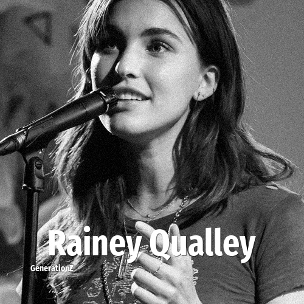

# Rainey Qualley

> **Rainey Qualley** was born in **1989**, making them a member of the Generation Y. Field: Musician.

Rainsford Dubose Qualley (born March 11, 1989) is an American actress and singer. The daughter of actress Andie MacDowell and the sister of actress Margaret Qualley, she made her acting debut in the 2012 film Mighty Fine. She is best known for her music, which she releases under the name Rainsford.

## Facts

| | |
|---|---|
| Born | 1989 |
| Field | Musician |
| Country | USA |
| Generation | [Generation Y](../generations/millennials/index.md) |
| Born in | [Year 1989](../born-in/1989.md) |
| Wikipedia | [Rainey Qualley on Wikipedia](https://en.wikipedia.org/wiki/Rainey_Qualley) |
| IMDb | [Rainey Qualley on IMDb](https://www.imdb.com/name/nm3958585/) |

----

_Last updated: 2026-09-23_
