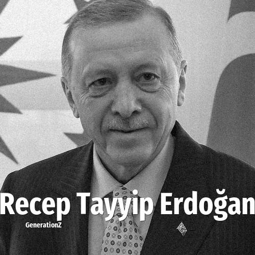

# Recep Tayyip Erdoğan

> **Recep Tayyip Erdoğan** was born in **1954**, making them a member of the Baby Boomers. Field: Politics.

Recep Tayyip Erdoğan (born 26 February 1954) is a Turkish politician who has been the president of Turkey since 2014. He previously served as the 25th prime minister from 2003 to 2014 as part of the Justice and Development Party, which he co-founded in 2001. He also served as mayor of Istanbul from 1994 to 1998. Coming from an Islamist background and promoting socially conservative policies, Erdoğan has been Turkey's de facto leader since 2003. Turkey has experienced democratic backsliding and suppression of dissent under Erdoğan.

## Facts

| | |
|---|---|
| Born | 1954 |
| Field | Politics |
| Country | Turkey |
| Generation | [Baby Boomers](../generations/baby-boomers/index.md) |
| Born in | [Year 1954](../born-in/1954.md) |
| Wikipedia | [Recep Tayyip Erdoğan on Wikipedia](https://en.wikipedia.org/wiki/Recep_Tayyip_Erdo%C4%9Fan) |
| IMDb | [Recep Tayyip Erdoğan on IMDb](https://www.imdb.com/name/nm5724012/) |

----

_Last updated: 2026-09-24_
