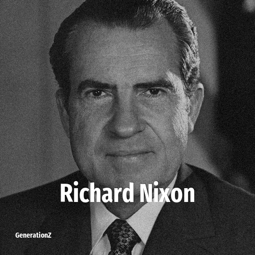

# Richard Nixon

> **Richard Nixon** was born in **1913**, making them a member of the Interbellum Generation. Field: Politics.

## Facts

| | |
|---|---|
| Born | 1913 |
| Field | Politics |
| Country | USA |
| Generation | [Interbellum Generation](../generations/interbellum-generation/index.md) |
| Born in | [Year 1913](../born-in/1913.md) |

----

_Last updated: 2026-06-04_
