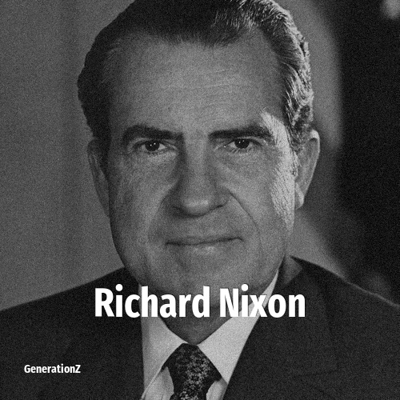

# Richard Nixon

> **Richard Nixon** was born in **1913**, making them a member of the Interbellum Generation. Field: Politics.

Richard Milhous Nixon (January 9, 1913 – April 22, 1994) was the 37th president of the United States, serving from 1969 until his resignation in 1974. A member of the Republican Party, he represented California in both houses of the United States Congress before serving as the 36th vice president under President Dwight D. Eisenhower from 1953 to 1961. His presidency saw the reduction of U.S. involvement in the Vietnam War, détente with the Soviet Union and China, the Apollo 11 Moon landing, and the establishment of the Environmental Protection Agency and Occupational Safety and Health Administration. Nixon's second term ended early when he became the only U.S. president to resign from office, as a result of the Watergate scandal.

## Facts

| | |
|---|---|
| Born | 1913 |
| Field | Politics |
| Country | USA |
| Generation | [Interbellum Generation](../generations/interbellum-generation/index.md) |
| Born in | [Year 1913](../born-in/1913.md) |
| Wikipedia | [Richard Nixon on Wikipedia](https://en.wikipedia.org/wiki/Richard_Nixon) |
| IMDb | [Richard Nixon on IMDb](https://www.imdb.com/name/nm0633271/) |

----

_Last updated: 2026-09-23_
