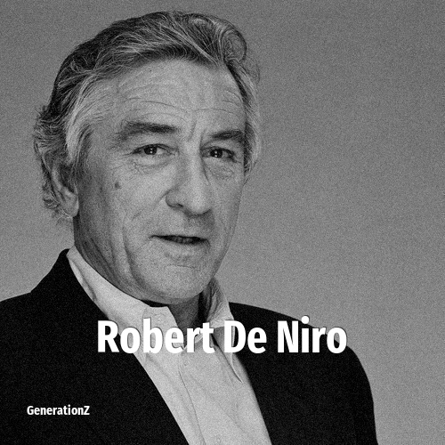

# Robert de Niro

> **Robert de Niro** was born in **1943**, making them a member of the Silent Generation. Field: Actor.

Robert Anthony De Niro (born August 17, 1943) is an American actor and producer. Widely regarded as one of the greatest and most influential actors of his generation, he has received various accolades, including two Academy Awards and a Golden Globe Award as well as nominations for eight BAFTA Awards and four Emmy Awards. He was honored with the AFI Life Achievement Award in 2003, the Kennedy Center Honors in 2009, the Cecil B. DeMille Award in 2011, the Presidential Medal of Freedom in 2016, the Screen Actors Guild Life Achievement Award in 2019, and the Honorary Palme d'Or in 2025.

## Facts

| | |
|---|---|
| Born | 1943 |
| Field | Actor |
| Country | USA |
| Generation | [Silent Generation](../generations/silent-generation/index.md) |
| Born in | [Year 1943](../born-in/1943.md) |
| Wikipedia | [Robert de Niro on Wikipedia](https://en.wikipedia.org/wiki/Robert_De_Niro) |
| IMDb | [Robert de Niro on IMDb](https://www.imdb.com/name/nm0000134/) |

----

_Last updated: 2026-09-23_
