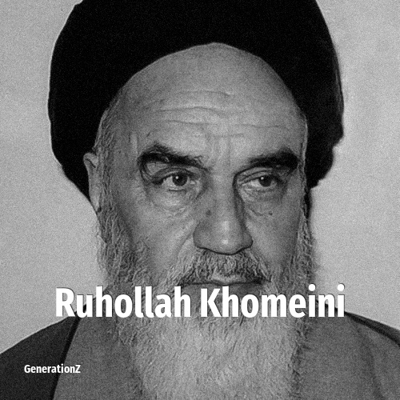

# Ruhollah Khomeini

> **Ruhollah Khomeini** was born in **1900**, making them a member of the Lost Generation. Field: Religion.

Ruhollah Mostafavi Khomeini (17 May 1900 – 3 June 1989) was an Iranian politician and Shia cleric who served as the first supreme leader of Iran from 1979 until his death in 1989. He was the leader of the Iranian Revolution, which overthrew Mohammad Reza Pahlavi, ended the Pahlavi era, and transformed the country into an Islamic republic. As supreme leader, he implemented policies that came to be known as Khomeinism.

## Facts

| | |
|---|---|
| Born | 1900 |
| Field | Religion |
| Country | Iran |
| Generation | [Lost Generation](../generations/lost-generation/index.md) |
| Born in | [Year 1900](../born-in/1900.md) |
| Wikipedia | [Ruhollah Khomeini on Wikipedia](https://en.wikipedia.org/wiki/Ruhollah_Khomeini) |
| IMDb | [Ruhollah Khomeini on IMDb](https://www.imdb.com/name/nm0451776/) |

----

_Last updated: 2026-09-24_
