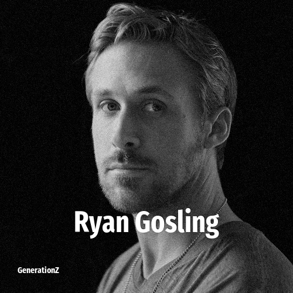

# Ryan Gosling

> **Ryan Gosling** was born in **1980**, making them a member of the Generation X. Field: Actor.

Ryan Thomas Gosling (born November 12, 1980) is a Canadian actor. Known for his work in both independent films and major studio features, his films as a leading actor have grossed over US$4 billion worldwide. He has received various accolades including a Golden Globe Award, in addition to nominations for three Academy Awards, nine Critics' Choice Awards, two British Academy Film Awards and a Primetime Emmy Award.

## Facts

| | |
|---|---|
| Born | 1980 |
| Field | Actor |
| Country | Canada |
| Generation | [Generation X](../generations/generation-x/index.md) |
| Born in | [Year 1980](../born-in/1980.md) |
| Wikipedia | [Ryan Gosling on Wikipedia](https://en.wikipedia.org/wiki/Ryan_Gosling) |
| IMDb | [Ryan Gosling on IMDb](https://www.imdb.com/name/nm0331516/) |

----

_Last updated: 2026-09-24_
