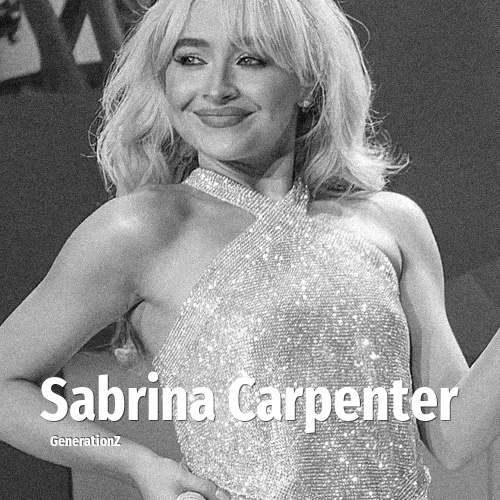

# Sabrina Carpenter

> **Sabrina Carpenter** was born in **1999**, making them a member of the Generation Z. Field: Musician.

Sabrina Annlynn Carpenter (born May 11, 1999) is an American singer, songwriter, and actress. Her accolades include two Grammy Awards, an Emmy Award, three American Music Awards, a Brit Award and four MTV Video Music Awards. She was recognized by Time in their Time 100 Next list in 2024. Carpenter first gained prominence starring as Maya Hart on the Disney Channel series Girl Meets World (2014–2017). She signed with Hollywood Records and achieved limited success with her studio albums, Eyes Wide Open (2015), Evolution (2016), Singular: Act I (2018), and Singular: Act II (2019).

## Facts

| | |
|---|---|
| Born | 1999 |
| Field | Musician |
| Country | USA |
| Generation | [Generation Z](../generations/generation-z/index.md) |
| Born in | [Year 1999](../born-in/1999.md) |
| Wikipedia | [Sabrina Carpenter on Wikipedia](https://en.wikipedia.org/wiki/Sabrina_Carpenter) |
| IMDb | [Sabrina Carpenter on IMDb](https://www.imdb.com/name/nm4248775/) |

----

_Last updated: 2026-09-24_
