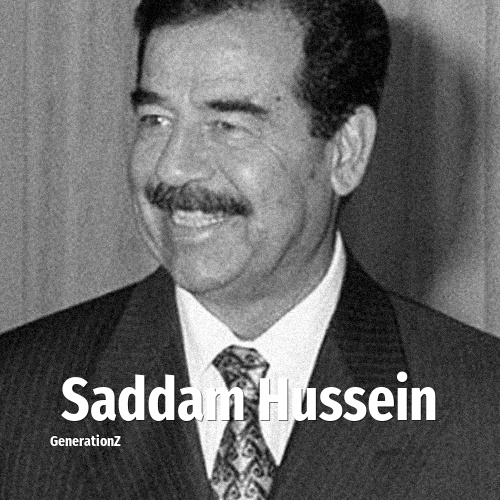

# Saddam Hussein

> **Saddam Hussein** was born in **1937**, making them a member of the Silent Generation. Field: Politics.

Saddam Hussein Abd al-Majid al-Tikriti (28 April 1937 – 30 December 2006) was an Iraqi politician and revolutionary who served as the fifth president of Iraq from 1979 until his overthrow in 2003. He also served as prime minister of Iraq from 1979 to 1991 and later from 1994 to 2003. He was a leading member of the revolutionary Arab Socialist Ba'ath Party, and later, the Baghdad-based Ba'ath Party and its regional organization, the Iraqi Ba'ath Party, which espoused Ba'athism, a mix of Arab nationalism and Arab socialism.

## Facts

| | |
|---|---|
| Born | 1937 |
| Field | Politics |
| Country | Iraq |
| Generation | [Silent Generation](../generations/silent-generation/index.md) |
| Born in | [Year 1937](../born-in/1937.md) |
| Wikipedia | [Saddam Hussein on Wikipedia](https://en.wikipedia.org/wiki/Saddam_Hussein) |
| IMDb | [Saddam Hussein on IMDb](https://www.imdb.com/name/nm0404010/) |

----

_Last updated: 2026-09-24_
