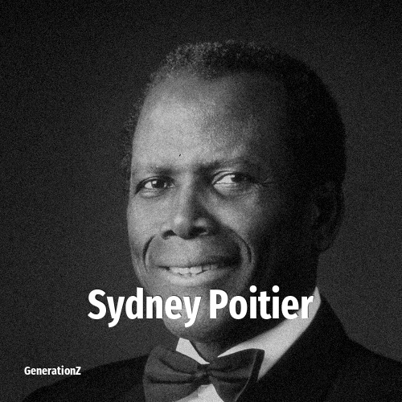

# Sydney Poitier

> **Sydney Poitier** was born in **1927**, making them a member of the Silent Generation. Field: Director.

Sidney Poitier (February 20, 1927 – January 6, 2022) was a Bahamian-American actor, film director, activist, and diplomat. In 1964, he was the first black actor and first Bahamian to win the Academy Award for Best Actor. Among his other accolades are two competitive Golden Globe Awards, a BAFTA Award and a Grammy Award, in addition to nominations for two Emmy Awards and a Tony Award. In 1999, he was ranked number 22 among the "American Film Institute's 100 Stars". Poitier was one of the last surviving stars from the Golden Age of Hollywood.

## Facts

| | |
|---|---|
| Born | 1927 |
| Field | Director |
| Country | USA |
| Generation | [Silent Generation](../generations/silent-generation/index.md) |
| Born in | [Year 1927](../born-in/1927.md) |
| Wikipedia | [Sydney Poitier on Wikipedia](https://en.wikipedia.org/wiki/Sidney_Poitier) |
| IMDb | [Sydney Poitier on IMDb](https://www.imdb.com/name/nm0001627/) |

----

_Last updated: 2026-09-23_
