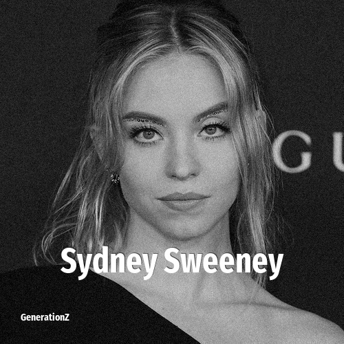

# Sydney Sweeney

> **Sydney Sweeney** was born in **1997**, making them a member of the Generation Z. Field: Actor.

Sydney Bernice Sweeney (born September 12, 1997) is an American actress. She gained early recognition for her roles in Everything Sucks!, The Handmaid's Tale, and Sharp Objects in 2018. She received wider acclaim for her performances in the drama series Euphoria (2019–2026) and the first season of the anthology series The White Lotus (2021), both of which earned her nominations for Primetime Emmy Awards.

## Facts

| | |
|---|---|
| Born | 1997 |
| Field | Actor |
| Country | USA |
| Generation | [Generation Z](../generations/generation-z/index.md) |
| Born in | [Year 1997](../born-in/1997.md) |
| Wikipedia | [Sydney Sweeney on Wikipedia](https://en.wikipedia.org/wiki/Sydney_Sweeney) |
| IMDb | [Sydney Sweeney on IMDb](https://www.imdb.com/name/nm2858875/) |

----

_Last updated: 2026-09-23_
