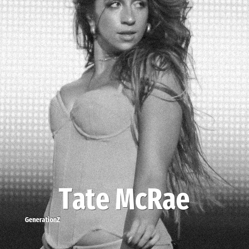

# Tate McRae

> **Tate McRae** was born in **2003**, making them a member of the Generation Z. Field: Musician.

Tate Rosner McRae (born July 1, 2003) is a Canadian singer, songwriter, and dancer. McRae began her career as a dancer, appearing as a contestant on the American reality television series So You Think You Can Dance in 2016. After signing with RCA Records, she released the extended plays (EPs) All the Things I Never Said (2020) and Too Young to Be Sad (2021); the latter became the most streamed female EP of 2021 on Spotify, while its single "You Broke Me First" marked her first US Billboard Hot 100 entry.

## Facts

| | |
|---|---|
| Born | 2003 |
| Field | Musician |
| Country | Canada |
| Generation | [Generation Z](../generations/generation-z/index.md) |
| Born in | [Year 2003](../born-in/2003.md) |
| Wikipedia | [Tate McRae on Wikipedia](https://en.wikipedia.org/wiki/Tate_McRae) |
| IMDb | [Tate McRae on IMDb](https://www.imdb.com/name/nm5950715/) |

----

_Last updated: 2026-09-24_
